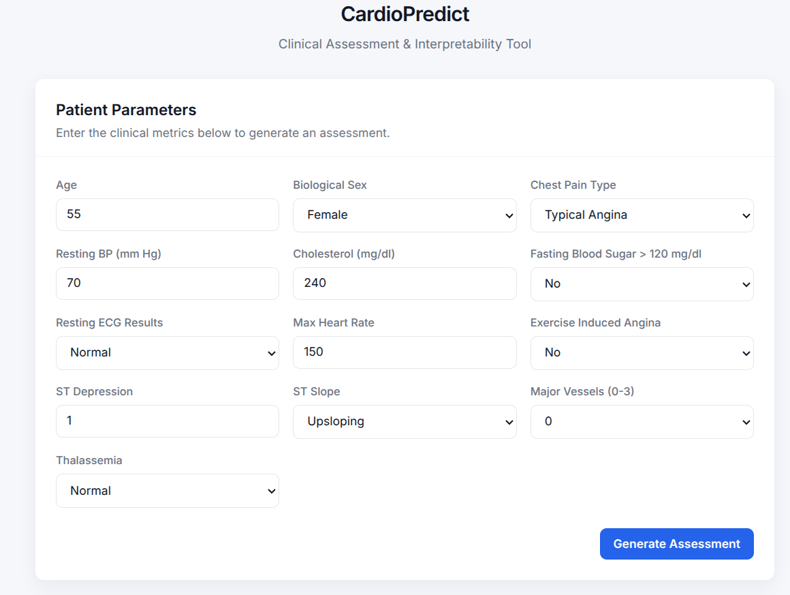
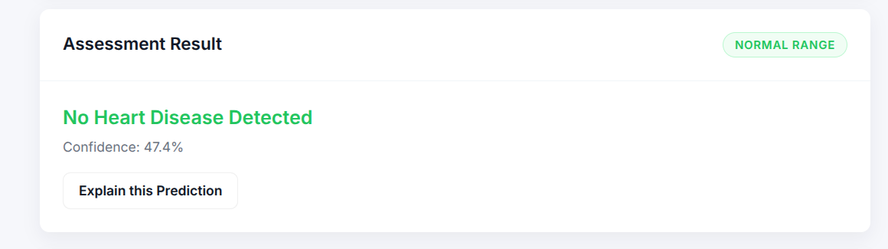
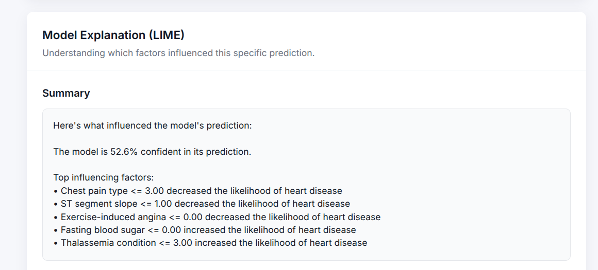
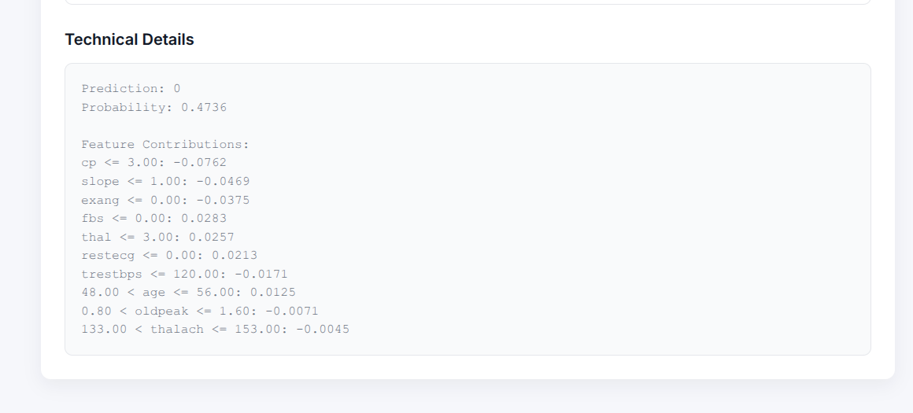

# CardioPredict
**Clinical Assessment & Interpretability Tool**

## Live Demo
[](https://heart-disease-prediction-lb9x.onrender.com/)

An end-to-end machine-learning web application for heart-disease prediction with dynamic model interpretability using LIME. 

## Application Preview

### Patient Assessment Interface


### Prediction Result


### LIME Model Interpretability


### Technical Details


## Key Features
- **Heart Disease Prediction**: Evaluates 13 clinical metrics to predict the likelihood of heart disease.
- **REST API**: Provides JSON-based prediction and interpretation endpoints.
- **Dynamic LIME Explanations**: Generates real-time, instance-specific model explanations.
- **User-Friendly Interpretation**: Translates complex feature importances into natural language summaries.
- **Technical Feature Contributions**: Displays raw LIME weights and generated plots for deep technical review.
- **Responsive Frontend**: Clean, minimal, and fully responsive custom UI.
- **Production Deployment**: Architected for lightweight deployment using Flask and Gunicorn on Render.

## Machine Learning Pipeline
The application utilizes robust `scikit-learn` pipelines that encapsulate data scaling (`RobustScaler`), feature selection (`SelectKBest`), and classification. This pipeline guarantees zero data leakage between training and testing phases. The core model deployed is evaluated via `RandomizedSearchCV` with Stratified K-Fold cross-validation to ensure optimal hyperparameters.

## Interpretability (LIME)
CardioPredict goes beyond black-box predictions. When a patient's metrics are submitted, the application dynamically invokes a **Local Interpretable Model-agnostic Explanations (LIME)** explainer. LIME perturbs the user's specific input data to approximate the complex global model with a simple, interpretable linear model locally. **This means the explanation you see is generated live for your exact input**, revealing exactly which clinical factors increased or decreased the prediction probability.

## Tech Stack
- **Backend**: Python, Flask, Gunicorn
- **Machine Learning**: Scikit-Learn, Pandas, NumPy, Joblib, LIME
- **Frontend**: HTML5, Vanilla CSS3, JavaScript (ES6)
- **Deployment**: Render

## Project Architecture
```text
.
├── app.py                      # Flask API and LIME inference logic
├── data/                       # Raw and processed clinical datasets
├── models/                     # Serialized best_model.joblib
├── src/                        # Model training and data processing logic
├── static/                     # CSS and JS for the frontend
├── templates/                  # HTML templates
├── requirements.txt            # Lightweight production dependencies (Render)
└── requirements-dev.txt        # Heavy dependencies for training (PyTorch, OpenCV)
```

## API Documentation

### `POST /api/predict`
Evaluates the clinical metrics and returns a prediction.
- **Request Body**: JSON object with 13 numeric features (`age`, `sex`, `cp`, `trestbps`, `chol`, `fbs`, `restecg`, `thalach`, `exang`, `oldpeak`, `slope`, `ca`, `thal`).
- **Response**:
  ```json
  {
    "prediction": 1,
    "probability": 0.6151,
    "message": "Heart Disease Detected"
  }
  ```

### `POST /api/interpretation`
Generates a dynamic LIME explanation for the submitted metrics.
- **Request Body**: Same as `/api/predict`.
- **Response**:
  ```json
  {
    "technical_interpretation": "Prediction: 1\nProbability: 0.6151...",
    "user_friendly_interpretation": "Here's what influenced the model's prediction...",
    "plot_image": "iVBORw0KGgoAAAANSUhEUgAAA..."
  }
  ```

## Installation & Local Setup

1. **Clone the repository**
   ```bash
   git clone https://github.com/yourusername/Heart-Disease-Prediction.git
   cd Heart-Disease-Prediction
   ```

2. **Create a virtual environment**
   ```bash
   python -m venv .venv
   source .venv/bin/activate  # On Windows: .venv\Scripts\activate
   ```

3. **Install dependencies**
   ```bash
   pip install -r requirements.txt
   ```

4. **Run the application**
   ```bash
   python app.py
   ```
   The application will run on `http://localhost:5000`.

## Production Deployment
This repository is configured for immediate deployment on Render Web Services. The `render.yaml` and `Procfile` map the deployment to Gunicorn (`gunicorn app:app`). 

### Development vs Production Dependencies
- **`requirements.txt`**: Contains only the lightweight dependencies required for inference (`flask`, `scikit-learn`, `pandas`, `lime`). This allows the app to deploy successfully within strict memory limits (e.g., Render Free Tier).
- **`requirements-dev.txt`**: Houses the heavy deep learning libraries (`torch`, `opencv`, `transformers`) necessary only if you wish to re-run the offline experimental training scripts in `src/`.

## Disclaimer
> **This project is intended for educational and research purposes only and is not a substitute for professional medical diagnosis or medical advice.**

## Future Improvements
- Expand input validation using Pydantic schemas.
- Implement comprehensive `pytest` suites for the inference API.
- Containerize the application using Docker for universal deployment.

## Author
**Tara Chand Jakhar**  
Final-year B.Tech Artificial Intelligence student specializing in Machine Learning and Software Engineering.
